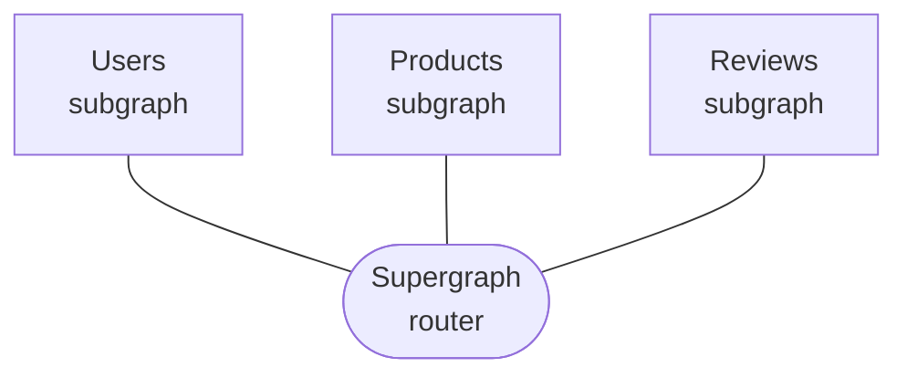

[](https://github.com/apollographql/federation-hotchocolate/actions?query=workflow%3A%22Continuous+Integration%22)
[](LICENSE)
[](https://www.nuget.org/packages/ApolloGraphQL.Federation.HotChocolate/)
[](https://community.apollographql.com)
[](https://discord.gg/graphos)


# Apollo Federation for Hot Chocolate

>This is a fork of `HotChocolate.Federation` module that aims to provide first class [Apollo Federation](https://www.apollographql.com/docs/federation/) support for [`HotChocolate` subgraphs](https://chillicream.com/docs/hotchocolate/v13).

[**Apollo Federation**](https://www.apollographql.com/docs/federation/) is a powerful, open architecture that helps you create a **unified supergraph** that combines multiple GraphQL APIs.
`ApolloGraphQL.Federation.HotChocolate` provides Apollo Federation support for building subgraphs in the `HotChocolate` ecosystem. Individual subgraphs can be run independently of each other but can also specify
relationships to the other subgraphs by using Federated directives. See [Apollo Federation documentation](https://www.apollographql.com/docs/federation/) for details.



## Installation

`ApolloGraphQL.Federation.HotChocolate` package is published to [Nuget](https://img.shields.io/nuget/v/ApolloGraphQL.Federation.HotChocolate). Update your `.csproj` file with following package references

```xml
  <ItemGroup>
    <!-- make sure to also include HotChocolate package -->
    <PackageReference Include="HotChocolate.AspNetCore" Version="13.5.1" />
    <!-- federation package -->
    <PackageInstallation packageName="ApolloGraphQL.Federation.HotChocolate"/>
  </ItemGroup>
```

After installing the necessary packages, you need to register Apollo Federation with your GraphQL service.


```csharp
var builder = WebApplication.CreateBuilder(args);

builder.Services
    .AddGraphQLServer()
    .AddApolloFederation()
    // register your types and services
    ;

var app = builder.Build();
app.MapGraphQL();
app.Run();
```

## Usage

Refer to [`HotChocolate` documentation](https://chillicream.com/docs/hotchocolate/v13) for detailed information on how to create GraphQL schemas and configure your server.

Apollo Federation requires subgraphs to provide some additional metadata to make them supergraph aware. Entities are GraphQL objects that can be uniquely identified across 
the supergraph by the specified `@key`s. Since entities can be extended by various subgraphs, we need an extra entry point to access the entities, i.e. subgraphs need to
implement reference resolvers for entities that they support.

Currently `ApolloGraphQL.Federation.HotChocolate` supports only Apollo Federation v1. See [Apollo documentation](https://www.apollographql.com/docs/federation/) for additional Federation details.

### Annotation

All federated directives are provided as attributes that can be applied directly on classes/fields/methods.

```csharp
[Key("id")]
public class Product
{
    public Product(string id, string name, string? description)
    {
        Id = id;
        Name = name;
        Description = description;
    }

    [ID]
    public string Id { get; }

    public string Name { get; }

    public string? Description { get; }

    // assumes ProductRepository with GetById method exists
    // reference resolver method must be public static
    [ReferenceResolver]
    public static Product GetByIdAsync(
        string id,
        ProductRepository productRepository)
        => productRepository.GetById(id);
}
```

This will generate following type

```graphql
type Product @key(fields: "id") {
    id: ID!
    name: String!
    description: String
}
```

#### Federation Attributes

Directives

* `Key` applicable on objects, see [`@key` documentation](https://www.apollographql.com/docs/federation/federated-types/federated-directives#key)
* `ExtendService` applicable on objects, see [`@extends` documentation](https://www.apollographql.com/docs/federation/federated-types/federated-directives#extends)
* `External` applicable on fields, see [`@external` documentation](https://www.apollographql.com/docs/federation/federated-types/federated-directives#external)
* `Provides` applicable on fields, see [`@provides` documentation](https://www.apollographql.com/docs/federation/federated-types/federated-directives#provides)
* `Requires` applicable on fields, see [`@requires` documentation](https://www.apollographql.com/docs/federation/federated-types/federated-directives#requires)

Entity resolution

* `Map` applicable on entity resolver method paramaters, allows you to map complex argument to a simpler representation value, e.g. `[Map("foo.bar")] string bar`
* `ReferenceResolver` applicable on static public methods to indicate entity resolver

### Code First

Alternatively, if you need more granular control, you can use code first approach and manually populate federation information on the underlying GraphQL type
descriptor. All federated directives expose corresponding methods on the applicable descriptor.

```csharp
public class Product
{
    public Product(string id, string name, string? description)
    {
        Id = id;
        Name = name;
        Description = description;
    }

    [ID]
    public string Id { get; }

    public string Name { get; }

    public string? Description { get; }
}

public class ProductType : ObjectType<Product>
{
    protected override void Configure(IObjectTypeDescriptor<Product> descriptor)
    {
        descriptor
            .Key("id")
            .ResolveReferenceWith(t => GetProduct(default!, default!));
    }

    private static Product GetProduct(
        string id,
        ProductRepository productRepository)
        => productRepository.GetById(upc);
}
```

This will generate following type

```graphql
type Product @key(fields: "id") {
    id: ID!
    name: String!
    description: String
}
```

## Contact

If you have a specific question about the library or code, please start a discussion in the [Apollo community forums](https://community.apollographql.com/) or start a conversation on our [Discord server](https://discord.gg/graphos).

## Contributing

To get started, please fork the repo and checkout a new branch. You can then build the library locally by running

```shell
# install dependencies
dotnet restore
# build project
dotnet build
# run tests
dotnet test
```

See more info in [CONTRIBUTING.md](CONTRIBUTING.md).

After you have your local branch set up, take a look at our open issues to see where you can contribute.

## Security

For more info on how to contact the team for security issues, see our [Security Policy](https://github.com/apollographql/federation-hotchocolate/security/policy).

## License

This library is licensed under [The MIT License (MIT)](LICENSE).